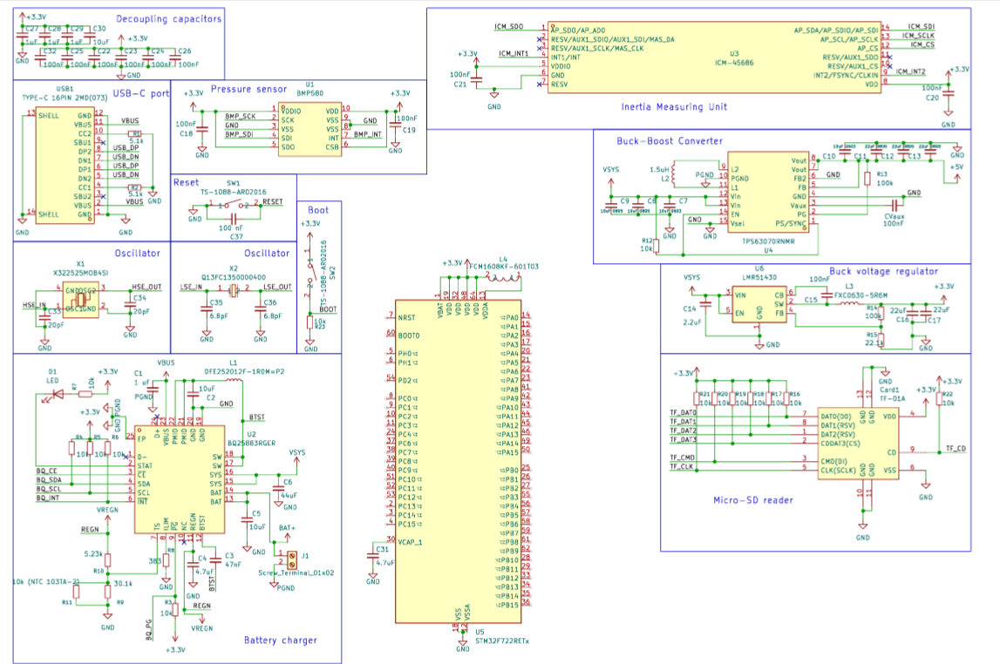

# Flight-control

## Overall
This is my first attempt of creating a drone flight controller. This version is mainly inspired by the tutorial https://github.com/notaroomba/simpleflightcontroller, but I also take a look at some other sources online such as http://www.brokking.net/ymfc-32_main.html  to choose the suitable parts.

## Parts

| LCSC ID | Part Number | Description | Package | link |
|---|---|---|---|---|
| C2765186 | TYPE-C 16PIN 2MD(073) | USB-C receptacle, 16-pin, right-angle | SMD, 16P | [Link](https://lcsc.com/product-detail/USB-Connectors_SHOU-HAN-TYPE-C-16PIN-2MD-073_C2765186.html) |
| C109322 | TPS63070RNMR | 3.6 A buck-boost DC/DC converter, 2–16 V input | VQFN-15-HR, 2.5×3 mm | [Link](https://lcsc.com/product-detail/DC-DC-Converters_Texas-Instruments-TPS63070RNMR_C109322.html) |
| C22459454 | ICM-45686 | 6-axis MEMS IMU | LGA-14, 3×2.5 mm | [Link](https://lcsc.com/product-detail/Accelerometers_TDK-InvenSense-ICM-45686_C22459454.html) |
| C22391138 | BMP580 | Barometric pressure sensor | LGA-10, 2×2 mm | [Link](https://www.lcsc.com/product-detail/Pressure-Sensors_Bosch-BMP580_C22391138.html) |
| C91145 | TF-01A | MicroSD / TF card socket, push-push | SMD | [Link](https://www.lcsc.com/product-detail/Connector-Card-Sockets_Korean-Hroparts-Elec-TF-01A_C91145.html) |
| C544362 | BQ25883RGER | 2-cell Li-ion/LiPo battery charger + power-path IC | VQFN-24-EP, 4×4 mm | [Link](https://www.lcsc.com/product-detail/Battery-Management-ICs-Texas-Instruments-BQ25883RGER_C544362.html) |
| C720477 | TS-1088-AR02016 | Tactile pushbutton switch, SPST | SMD, 4×3 mm | [Link](https://www.lcsc.com/product-detail/Pushbutton-Switches_XUNPU-TS-1088-AR02016_C720477.html) |
| C9006 | X322525MOB4SI | 25 MHz crystal, ±10 ppm, 12 pF | SMD3225-4P | [Link](https://www.lcsc.com/product-detail/SMD-Crystals_Yangxing-Tech-X322525MOB4SI_C9006.html) |
| C32346 | Q13FC13500004 | 32.768 kHz crystal, ±20 ppm, 12.5 pF | SMD3215-2P | [Link](https://www.lcsc.com/product-detail/SMD-Crystals_EPSON-Q13FC13500004_C32346.html) |
| C141723 | FCM1608KF-601T03 | Ferrite bead, 600 Ω @ 100 MHz | 0603 | [Link](https://www.lcsc.com/product-detail/Ferrite-Beads_TAI-TECH-FCM1608KF-601T03_C141723.html) |
| — | — | 2S 30C 7.4V lipo battery | — | [Link](https://www.aliexpress.us/item/3256812711097801.html) |
| C308949 | LMR51430 | 4.5 V–36 V, 3 A synchronous buck converter | SOT-23-6 | [Link](https://www.lcsc.com/product-detail/DC-DC-Converters_Texas-Instruments-LMR51430YFDDCR_C308949.html) |

## Description

### Power
For power, I decided to use a 2S 30C 2200mAh Lipo battery, which have a voltage of 7.4V. From this I'll devide in to 2 power lines: a 3.3V line for MCU and sensors and and 5V line for Servo and other accessories.

To regulate the power, I'll have a Buck-Boost converter (TPS63070RNMR) to regulate the input voltage to the 5V line and a Buck converter (LMR51430) to regulate voltage to a 3.3V line.

I will also use a battery charger circuit BQ25883RGER to to charge the flight controller without having to remove and charge the battery seperately.

About all the circuits, the value of resistors, capacitors and wiring, I wire them based on the example on the parts datasheet, typically the "Typical Application" part.

### Sensor

For sensors, I use an BMP580 Biometric pressure sensor to measure the height of the drone, a IMU ICM-45668 to measure the drone's acceleration, rotation and orientation, a SD card to store data.

Again, for circuits, the parts' datasheets are my bestfriend, and then I crosscheck what I did with the tutorials just to make sure everything works.

### Firmware

For firmware, as my MCU is a STM32, I decided to use the STM32CUBEMX to program for its firmware. Honestly, I choose CUBEMX partly because the tutorial do so, but because it is also working on lower level than Arduino but still easier than STM32CUBEIDE.

** Still working on **

## Schematic

## PCB Layout

** Still working on ***

### Updates
| Date | Description | PIC |
|---|---|---|
| Sept 17 2026 | Initial Upload | Thong |
